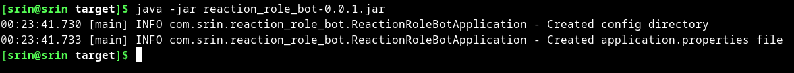
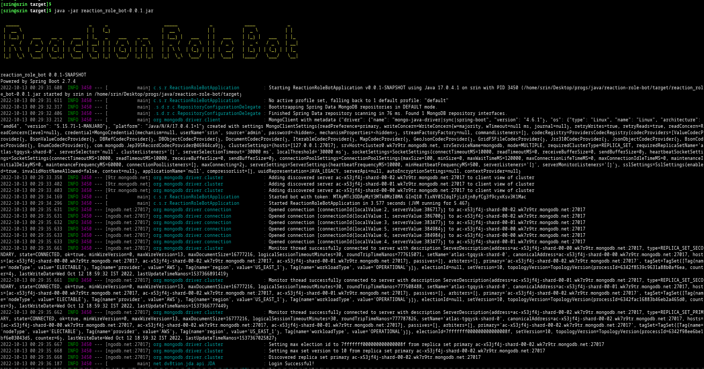
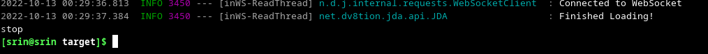

# Reaction role bot

## get started

- Download the jar file
- Then open terminal and navigate to the folder where you've downloaded the jar file
- Then type `java -jar reaction_role_bot_0.0.1.jar` and press enter.  
  _example:_  
   
  _This will create an **application.yml** file in a **config** folder_
  - Open the **application.yml** file in a text editor  
    _Replace the default value with your own suitable values_  
    It should follow the following format: 
  ```yaml
  bot:
    token: "token"
    reactions:
      "channelId":
        "messageId":
          #for custom emote use the emote format discord uses
          #example: <:emote-name:emoteId> for normal emotes and
          #         <a:emote-name:emoteId> for animated emotes
          "[custom-emote-code]": "roleId"
          #for unicode emotes provide the codepoint for that emote
          #in U+XXXX format where XXXX is the codepoint of the emote in hexadecimal
          "[U+XXXX]": "roleId"
  ```
  _sample yml:_
  ```yml
  bot:
    token: "MTAyM5c3ODAyMzY3Mdk0Mzs0MA.GInQ10.TixNYdSZdqIFjLzXjn8yfgg3f9cyxKsv3K1Mac"
    reactions:
      "715957604773265528":
        "1030077993994965032":
          "[<:hi:971428204181069834>]": "1029751749910741022"
          "[U+1f602]": "1029751877677633596"
      "763619247087419452":
        "1030078115717861386":
          "[U+1f602]": "1029751877677633596"
  ```

- Then save the file and exit the text editor.
- Repeat 2nd and 3rd step

  

- If all the values in **application.properties** file are correct then the bot will start without any issues   
  and log a message `Login Successful!` to the console
## Stop the bot

To stop the bot just type `stop` in the console and press enter. This should stop the bot and it'll go offline.


