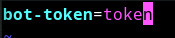
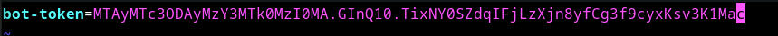

# Reaction role bot

## get started

- Download the jar file
- Then open terminal and navigate to the folder where you've downloaded the jar file
- Then type `java -jar reaction-role-bot-0.0.1.jar` and press enter.  
  _example:_  
   
  _This will create an **application.properties** file in a **config** folder_
- Open the **application.properties** file in a text editor  
  _Replace the default value with your own suitable values_  
  
1. `bot-token` - Your bot token
   _a sample **application.properties** file:_
   

- Then save the file and exit the text editor.
- Repeat 2nd and 3rd step

  

- If all the values in **application.properties** file are correct then the bot will start without any issues   
  and log a message `Login Successful!` to the console
## Stop the bot

To stop the bot just type `stop` in the console and press enter. This should stop the bot and it'll go offline.

